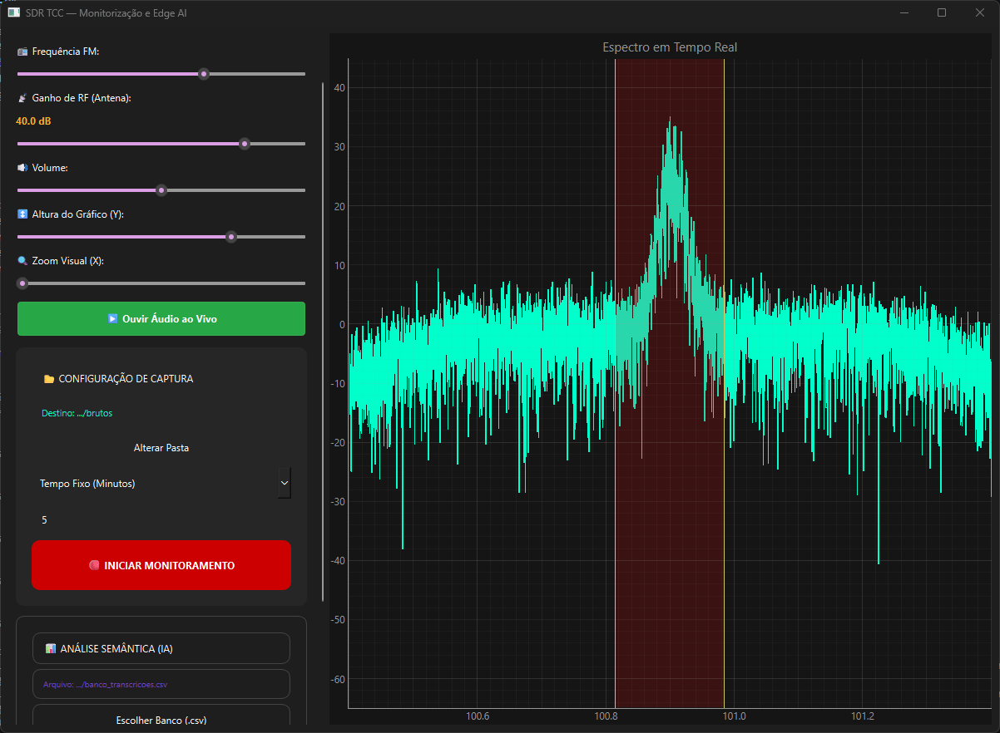

# 📡 Sistema SDR Inteligente: Monitorização e Edge AI


> Plataforma avançada de Inteligência de Sinais (SIGINT) que automatiza a captura, descodificação, transcrição e análise semântica de transmissões de rádio (FM) em tempo real, utilizando processamento 100% local (Edge Computing).

Este repositório contém o código-fonte desenvolvido para o Trabalho de Conclusão de Curso (TCC) em Engenharia. O foco principal é garantir privacidade, segurança e autonomia, processando dados sem qualquer dependência de serviços na nuvem.

*Demo de demonstração da ferramenta*


---

## ✨ Funcionalidades Principais

- **📻 Motor DSP Customizado:** Desmodulação de rádio FM em tempo real com numpy e scipy, aplicando decimação matemática e filtros Butterworth/De-Emphasis de forma multi-thread, com suporte robusto a desconexões de hardware.
- **🎙️ Transcrição Offline (Speech-to-Text):** Conversão de áudio com ruídos em texto estruturado usando o modelo OpenAI Whisper (`base`).
- **🧠 Inteligência Analítica (LLM):** Classificação, extração de entidades e resumos usando Meta Llama 3.2 (1B) rodando localmente no Ollama.
- **📊 Dashboards Automáticos:** Geração de relatórios analíticos, gráficos de desempenho e linha do tempo de captações. Suporta retrocompatibilidade automática com bancos de dados legados (CSV sem cabeçalho).
- **🖥️ Interface Gráfica Responsiva:** Desenvolvida em PyQt6 com visualização de espectro de radiofrequência em tempo real, isolando as threads de UI, DSP e Whisper para garantir fluidez.

---

## 🛠️ Tecnologias Utilizadas

- **Interface:** `PyQt6`, `pyqtgraph`
- **DSP e Áudio:** `numpy`, `scipy`, `sounddevice`, hardware RTL-SDR Blog V4 (`pyrtlsdr`, `pyrtlsdrlib`)
- **Inteligência Artificial:** `openai-whisper` (PyTorch), `ollama` (Llama 3.2 1B)
- **Análise de Dados:** `pandas`, `matplotlib`, `seaborn`

---

## 🚀 Como Instalar e Executar

### Pré-requisitos Obrigatórios
1. **Python 3.10 ou superior:** Instalado no sistema.
2. **FFmpeg:** Obrigatório para o Whisper. Instale e garanta que está [adicionado ao PATH do Windows](https://phoenixnap.com/kb/ffmpeg-windows). O sistema também tentará localizar instalações feitas via `winget` automaticamente.
3. **Antena RTL-SDR:** Conectada via USB. Você deve instalar os drivers WinUSB corretos usando o software [Zadig](https://zadig.akeo.ie/).
4. **Ollama:** Instale o [Ollama](https://ollama.com/) e deixe o servidor rodando em segundo plano.

### Passo a Passo

**1. Clonar o Repositório:**
```bash
git clone https://github.com/ntcdave/Sistema-SDR-Inteligente-TCC_2.git
cd Sistema-SDR-Inteligente-TCC_2
```

**2. Instalar Dependências:**
Recomendamos o uso de um ambiente virtual (venv).
```bash
pip install -r requirements.txt
```

**3. Descarregar os Modelos de IA:**
O modelo Whisper (`base`) será baixado automaticamente na primeira execução (~140MB). Para a análise semântica, baixe o modelo Llama via Ollama:
```bash
ollama pull llama3.2:1b
```

**4. Iniciar a Aplicação:**
Com a antena ligada e configurada, execute o entry point principal do sistema:
```bash
python main.py
```

---

## 📂 Organização do Projeto

```text
projeto/
├── main.py                 # Entry point (Bootstrap de ambiente e variáveis de PATH)
├── app.py                  # Interface principal (PyQt6) e orquestração de módulos
├── requirements.txt        # Lista de dependências Python
├── src/
│   ├── transcricao.py      # Interação com o OpenAI Whisper (STT)
│   ├── analise.py          # Interrogador do Llama 3.2 e gerador de gráficos
│   └── dsp.py              # Motor DSP (hardware SDR, fila IQ, ring buffer)
├── dados/                  # Banco de dados CSVs, relatórios e chunks (.wav)
└── ferramentas/rtl-sdr/    # DLLs e utilitários da RTL-SDR para Windows
```

---

## 📖 Documentação Técnica Avançada

Para entender a fundo a arquitetura do projeto, fluxo de dados do Processamento Digital de Sinal (DSP), padrões de projeto aplicados e pontos de extensibilidade, consulte a nossa documentação completa:

👉 **[Ler a Especificação Completa (SPEC.me)](./SPEC.me)**

---

## 🤝 Contribuição e Resolução de Problemas (Troubleshooting)

Este projeto é **Open Source**! A comunidade é muito bem-vinda para explorar o código, abrir Issues para reportar problemas ou sugerir melhorias através de Pull Requests. 

Caso encontre alguma dificuldade inicial na execução, confira as soluções para os problemas mais comuns relatados pela comunidade:

- **Erro na biblioteca RTL-SDR:** Verifique se a pasta `ferramentas/rtl-sdr/` contém a `rtlsdr.dll` e se você configurou os drivers corretos usando o Zadig. (Usuários Linux/macOS podem precisar compilar a biblioteca localmente). Se encontrar erros como `AttributeError: function 'rtlsdr_set_dithering' not found`, assegure-se de que a biblioteca pyrtlsdr está atualizada.
- **Falhas de Conexão com Antena ("Hardware Desconectado"):** O motor DSP (`src/dsp.py`) agora detecta automaticamente e lida de forma graciosa com erros `OSError` e desconexões de antena, emitindo logs e encerrando as threads corretamente para não causar "access violation".
- **Falha ao Transcrever Áudio:** Se a aplicação apresentar erros durante o Whisper, o `ffmpeg` provavelmente não foi encontrado pelo sistema. Assegure-se de que ele está instalado e configurado no PATH. O `main.py` tenta injetar o caminho do ffmpeg do winget, mas a forma mais segura é adicioná-lo manualmente.
- **Análise Semântica não inicia:** A IA necessita do servidor Ollama ativo. Verifique se o `ollama serve` está sendo executado em segundo plano. Além disso, o sistema de análise agora lê arquivos CSV legados ou novos de forma inteligente, dispensando conversões manuais.

Sentiu falta de alguma funcionalidade ou conseguiu resolver um bug diferente? **Contribua com o projeto abrindo uma Pull Request!**

---

> *Trabalho académico desenvolvido para investigar a implementação de técnicas de Edge AI aplicadas a Radiofrequência e processamento DSP em tempo real.*
