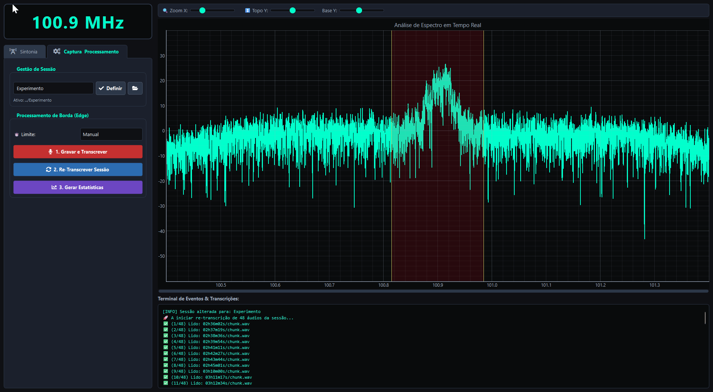

# 📡 Sistema SDR Inteligente: Monitoramento e Edge AI


> Plataforma avançada de Inteligência de Sinais (SIGINT) que automatiza a captura, decodificação, transcrição e análise semântica de transmissões de rádio (FM), utilizando processamento 100% local (Edge Computing).

Este repositório contém o código-fonte desenvolvido para fins de pesquisa científica em Inteligência de Sinais e Edge AI, com foco em garantir privacidade, segurança e autonomia, processando dados sem qualquer dependência de serviços na nuvem ou APIs externas.

*Demonstração da ferramenta em execução*


---

## ✨ Funcionalidades Principais

- **📻 Motor DSP Customizado:** Demodulação de rádio FM em tempo real com numpy e scipy, aplicando decimação matemática (decimação IQ de 4x e decimação de áudio de 8x) e filtros Butterworth/De-Emphasis de forma multi-threaded (threads isoladas de leitura e decodificação), com suporte robusto a desconexões de hardware.
- **🎙️ Transcrição Offline (Speech-to-Text):** Conversão de áudio em texto em tempo real usando o modelo local OpenAI Whisper (`base`), com proteções anti-alucinação incorporadas (como filtros para chiados e silêncios redundantes).
- **⏱️ Controle de Tempo de Gravação (Captura Temporizada):** Três modalidades flexíveis de controle de tempo pela interface:
  - *Manual:* Início e encerramento da captura sob demanda pelo operador.
  - *Por Duração:* Definição de limite de tempo exato em minutos para finalização automática da escuta.
  - *Até Horário:* Agendamento programado para encerramento automático da captura ao atingir o horário estabelecido.
- **📂 Gestão Dinâmica de Sessões (Projetos):** Separação lógica e física das missões de escuta. O sistema cria automaticamente estruturas organizadas de diretórios baseadas no nome do projeto ou timestamp (`dados/projetos/<nome_sessao>`), isolando os áudios WAV capturados, o banco de dados CSV de transcrições e os gráficos analíticos.
- **🔄 Painel de Re-transcrição de Sessões:** Funcionalidade que varre de forma concorrente (multithread) e segura todos os arquivos de áudio `.wav` de uma sessão anterior, reconstruindo e higienizando o banco de dados CSV de transcrições sem duplicidades, contando com controle de cancelamento em tempo de execução.
- **🧠 Mapeamento Ontológico OSINT (Edge NLP):** Classificação semântica otimizada no pós-processamento de termos e frases-chave contra uma árvore de conhecimento (ontologia) estruturada de rádio com categorias de interesse de segurança pública (Armamento, Mobilidade Tática, Ocorrências, Narcotráficos/Facções, Trânsito/Logística, etc.), executada em lote (batch) de forma instantânea e 100% local.
- **📊 Dashboards Automáticos:** Geração de matrizes estatísticas em CSV e 5 gráficos de publicação de alta fidelidade (Nuvem de Palavras, Distribuição de Domínios Ontológicos em Donut, Termos Mais Frequentes, Expressões Recorrentes/Bigramas e Linha do Tempo de Interceptações).
- **🖥️ Interface Gráfica Responsiva:** UI moderna desenvolvida em PyQt6 com visualização de espectro de radiofrequência em tempo real e controles avançados de escala visual (Zoom X, Topo Y e Base Y), isolando as threads de UI, DSP e Whisper para assegurar uma experiência fluida.

---

## 🛠️ Tecnologias Utilizadas

- **Interface:** `PyQt6`, `pyqtgraph` (aceleração por GPU) e `qtawesome`
- **DSP e Áudio:** `numpy`, `scipy`, `sounddevice`, e hardware RTL-SDR Blog V4 (`pyrtlsdr`, `pyrtlsdrlib`)
- **Inteligência Artificial (STT):** `openai-whisper` (PyTorch) rodando localmente
- **Análise Semântica (NLP):** Processamento estatístico clássico em Python com stopwords otimizadas para português e árvore ontológica de OSINT
- **Análise de Dados e Plotting:** `pandas`, `matplotlib` (backend não interativo `Agg`), `seaborn` e `wordcloud`

---

## 🚀 Como Instalar e Executar

### Pré-requisitos Obrigatórios
1. **Python 3.10 ou superior:** Instalado no sistema.
2. **FFmpeg:** Obrigatório para o Whisper. Instale e garanta que está adicionado ao PATH do Windows. O sistema também tentará localizar instalações feitas via `winget` automaticamente.
3. **Placa de Som (Saída de Áudio):** O host deve possuir um dispositivo reprodutor de áudio padrão ativo para inicialização correta do stream via biblioteca `sounddevice`.
4. **Antena RTL-SDR:** Conectada via USB. Você deve instalar os drivers WinUSB corretos usando o software [Zadig](https://zadig.akeo.ie/).

### Passo a Passo

**1. Clonar o Repositório:**
```bash
git clone https://github.com/anonymous/sdr-edge-ai.git
cd sdr-edge-ai
```

**2. Instalar Dependências:**
Recomendamos o uso de um ambiente virtual (venv).
```bash
python -m venv .venv
# No Windows (PowerShell):
.\.venv\Scripts\Activate.ps1
# No Linux/macOS:
source .venv/bin/activate

pip install -r requirements.txt
```

**3. Baixar os Modelos de IA:**
O modelo Whisper (`base`) será baixado de forma automatizada na primeira execução (~140MB) e salvo localmente. Não é necessária nenhuma outra configuração de IA ou servidores locais.

**4. Iniciar a Aplicação:**
Com a antena conectada e configurada, execute o ponto de entrada principal do sistema:
```bash
python main.py
```

---

## 📂 Organização do Projeto

```text
projeto/
├── main.py                 # Ponto de entrada (Bootstrap, caminhos de DLLs e FFmpeg)
├── app.py                  # Interface gráfica principal (PyQt6) e orquestração dos módulos
├── config.py               # Configurações globais, constantes DSP, stopwords e dicionário ontológico
├── requirements.txt        # Lista de dependências Python reais do projeto
├── src/
│   ├── dsp.py              # Motor DSP (hardware SDR, threads de leitura e processamento, ring buffer SPSC)
│   ├── transcricao.py      # TranscritorSDR: Interação local com o OpenAI Whisper (STT) e filtros anti-alucinação
│   └── analise.py          # CientistaSDR: Análise de NLP estatístico, mapeamento ontológico e geração de gráficos
├── ferramentas/rtl-sdr/    # DLLs e utilitários nativos da RTL-SDR para Windows (linkagem dinâmica)
└── dados/projetos/         # Armazenamento local estruturado das sessões de escuta
    └── <nome_da_sessao>/
        ├── audios/         # Chunks de áudio .wav gerados na captura
        ├── estatisticas/   # Gráficos PNG analíticos e matrizes estatísticas em CSV
        └── transcricoes_<nome_da_sessao>.csv  # Histórico de voz transcrita e frequência
```

---

## 📖 Documentação Técnica Avançada

Para compreender detalhadamente a arquitetura do projeto, fluxo de dados do Processamento Digital de Sinal (DSP), padrões de projeto aplicados e pontos de extensibilidade, consulte o nosso documento de especificação técnica:

👉 **[Ler a Especificação Completa (Spec.md)](./Spec.md)**

---

## 🤝 Resolução de Problemas (Troubleshooting)

- **Erro na biblioteca RTL-SDR:** Verifique se a pasta `ferramentas/rtl-sdr/` contém a `rtlsdr.dll` e se você configurou os drivers corretos usando o Zadig. Se encontrar erros como `AttributeError: function 'rtlsdr_set_dithering' not found`, certifique-se de que a biblioteca pyrtlsdr está atualizada.
- **Falhas de Conexão com Antena ("Hardware Desconectado"):** O motor DSP detecta automaticamente desconexões de antena (`OSError`), parando as threads em segundo plano de forma graciosa sem travar a interface da aplicação.
- **Falha ao Transcrever Áudio:** Se o sistema apresentar falhas na transcrição Whisper, confirme se o `ffmpeg` está corretamente instalado e visível nas variáveis de ambiente globais.
- **Ausência de Som ao Vivo:** O sistema necessita de uma placa ou dispositivo físico de áudio padrão ativo configurado no Windows para que a biblioteca `sounddevice` execute o callback do buffer circular sem falhas.

---

> *Projeto de pesquisa científica desenvolvido para investigar a implementação de técnicas de Edge AI aplicadas a Radiofrequência e processamento DSP local.*
